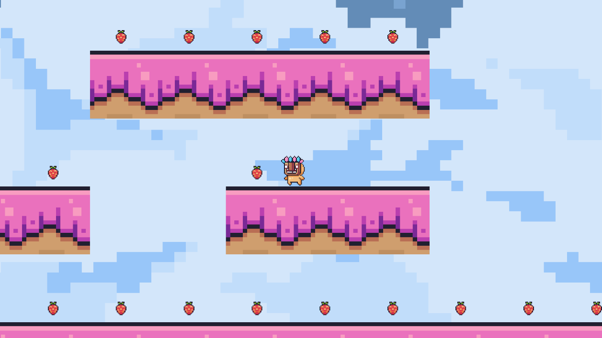

# Game-Master

2D fruit-collection game for study and enjoyment

## Implemented Features

This project includes several features beyond Unity's default setup:

### 1. Character Movement  

A custom movement system was implemented, allowing the character to walk and jump.  
This was achieved through C# scripts that ensure a responsive and interactive gameplay experience.  

### 2. Animation System  

The Unity Animator was used to create smooth transitions between different animation states, such as walking and jumping.  
These animations were integrated with player controls to match the character’s actions dynamically.  

### 3. Level Design with Tilemaps  

Tilemaps were used for an efficient and modular level design approach.  
This allows for easy creation and editing of levels, making iteration faster.  

### 4. 2D Physics Implementation  

Physics components such as colliders and rigidbodies were configured to enable realistic interactions between the character and the environment.  
Adjustments were made to refine gameplay mechanics and improve response to player inputs.  

---

These features showcase the knowledge gained throughout the development of the project, enhancing the overall quality of the game.
